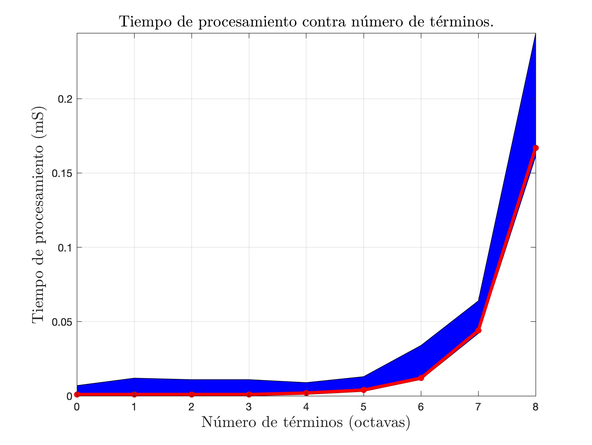
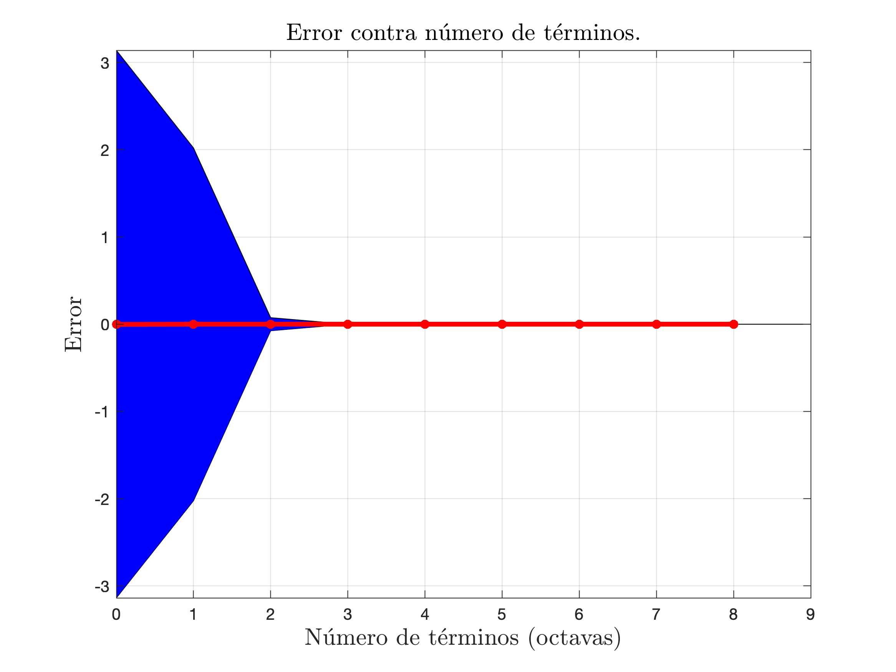
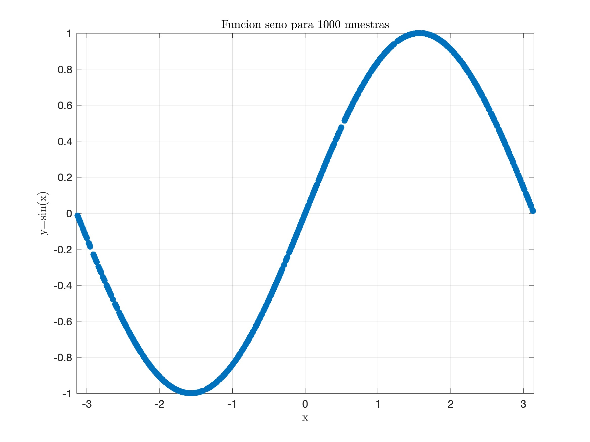
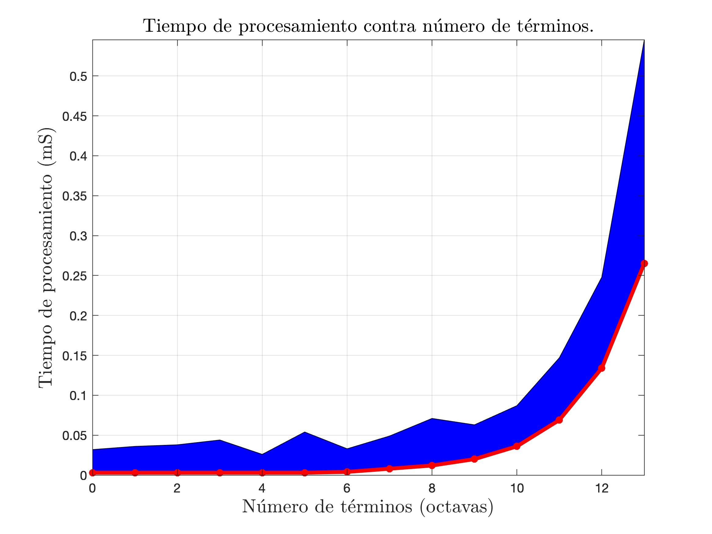
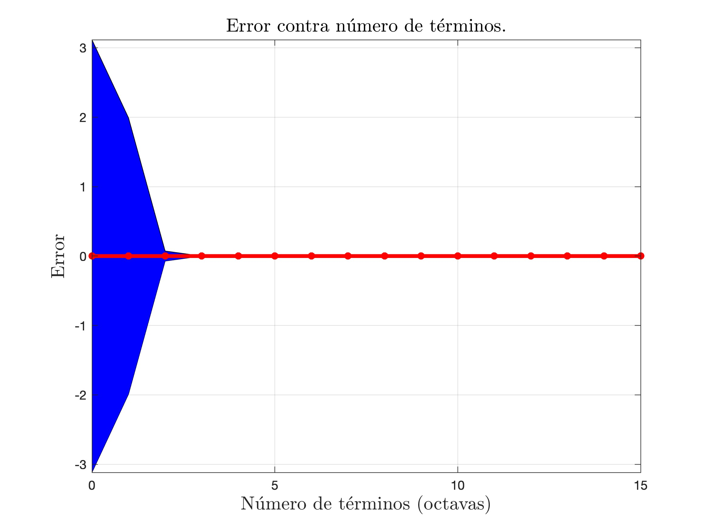

<br />
<div align="center">
  <a href="https://github.com/ibarram/AyE">
    
  </a>

  <h3 align="center">Algoritmos y Estructuras de Datos (IILI06004)</h3>

  <p align="center">
    Licenciatura en Ingeniería de Datos e Inteligencia Artificial (IS75LI0801)
    <br />
    <a href="https://github.com/ibarram/AyE"><strong>Explorar la documentación »</strong></a>
    <br />
    <br />
    <a href="https://github.com/ibarram/AyE">Ver Demo</a>
    ·
    <a href="https://github.com/ibarram/AyE/issues">Reportar Bug</a>
    ·
    <a href="https://github.com/ibarram/AyE/issues">Requiere Modificaciones</a>
  </p>
</div>

<details><summary>Table of Contents</summary><p>
 
 * [Conceptos fundamentales de algoritmos](#Conceptos-fundamentales-de-algoritmos)

 * [Recursividad](#Recursividad)

 * [Estructuras de datos fundamentales](#Estructuras-de-datos-fundamentales)

 * [Algoritmos de ordenamiento](#Algoritmos-de-ordenamiento)

 * [Algoritmos de búsqueda](#Algoritmos-de-búsqueda)

 * [Análisis de algoritmos](#Análisis-de-algoritmos)

</p></details><p></p>

## Conceptos fundamentales de algoritmos

### 1. Cálculo de Seno con Serie de Taylor (Inicial): [001_seno_serie_ini.c](../../src/001_seno_serie_ini.c)
   - **Descripción**: Este código calcula la aproximación del seno de $$x$$ en radianes utilizando la **serie de Taylor**. El número $$n$$ de términos de la serie es configurable.

   Utiliza la serie siguiente:

   $$sen(x)=\sum_{i=1}^{n}{(-1)^{i+1}\frac{x^{2i-1}}{(2i-1)!}}=x-\frac{x^3}{3!}+\frac{x^5}{5!}-\frac{x^7}{7!}+...$$

   Cada término es obtenido de la siguiente forma:

   $$(-1)^{i+1}\frac{x^{2i-1}}{(2i-1)!}=(-1\times-1\times-1\times\dotsm-1\times-1)\frac{x\times x\times x\times\dotsm x\times x}{1\times2\times3\times\dotsm\times(2(i-1))\times (2i-1)}$$

   - **Temas clave**: Serie de Taylor, Funciones Trigonométricas, Bucles, Ciclos, Bifurcaciones.
   - **Ubicación**: `src/001_seno_serie_ini.c`
   - **Compilación**:
     ```bash
     make 001_seno_serie_ini
     ```
   - **Uso**:
     ```bash
     ./001_seno_serie_ini
     ```

     La siguiente figura muestra la simulación para $$1000$$ puntos de la señal seno generados mediante una distribución uniforme discreta en el rango de $$[-\pi, \pi]$$.

<p align="center">
  
  
  
</p>
<p align="center">
  <strong>Figura 1: (a) Grafica de los puntos de la función seno, (b) Grafica del tiempo de procesamiento contra el numero de terminos en octavas, (c) Grafica del error en el calculo de la función seno.</strong>
</p>

### 2. Cálculo de Seno con Serie de Taylor (Optimizada): [002_seno_serie_opt.c](../../src/002_seno_serie_opt.c)
   - **Descripción**: Este código calcula la aproximación del seno de $$x$$ en radianes utilizando la **serie de Taylor**. El número $$n$$ de términos de la serie es configurable. Realiza un ajuste el los terminos para garantizar la convergencia y reducir el tiempo de cómputo.

   Utiliza la siguiente serie:

   $$sen(x)=\sum_{i=1}^{n}{(-1)^{i+1}\frac{x^{2i-1}}{(2i-1)!}}=x-\frac{x^3}{3!}+\frac{x^5}{5!}-\frac{x^7}{7!}+...$$

   Realiza el término mediante la siguiente optimización:

   $$(-1)^{i+1}\frac{x^{2i-1}}{(2i-1)!}=(2\times((i+1)\bmod 2)-1)\times x\times\frac{x}{2}\times\frac{x}{3}\times\dotsm\times\frac{x}{2(i-1)}\times\frac{x}{2i-1}$$

   - **Temas clave**: Serie de Taylor, Funciones Trigonométricas, Precisión, Optimización, Bucles, Ciclos, Bifurcaciones.
   - **Ubicación**: `src/002_seno_serie_opt.c`
   - **Compilación**:
     ```bash
     make 002_seno_serie_opt
     ```
   - **Uso**:
     ```bash
     ./002_seno_serie_opt
     ```

     Se realizaron $$1000$$ simulaciones, cada valor de $$x$$ fue generado mediante una distribución uniforme discreta en el rango de $$[-\pi,\pi]$$, para las primeras $$15$$ octavas para el valor de $$n$$.

<p align="center">
  
  
  
</p>
<p align="center">
  <strong>Figura 2: (a) Grafica de los puntos de la función seno, (b) Grafica del tiempo de procesamiento contra el numero de terminos en octavas, (c) Grafica del error en el calculo de la función seno.</strong>
</p>

### 3. Cálculo de Seno con Serie de Taylor (Optimizada) con entradas por argumentos: [003_seno_serie_par.c](../../src/003_seno_serie_par.c)
   - **Descripción**: Este código calcula la aproximación del seno de $$x$$ en radianes utilizando la **serie de Taylor**. El número $$n$$ de términos de la serie es configurable. Ambos parámetros, tanto $$x$$ como $$n$$ son capturados mediante argumentos de entrada.

   $$sen(x)=\sum_{i=1}^{n}{(-1)^{i+1}\frac{x^{2i-1}}{(2i-1)!}}=x-\frac{x^3}{3!}+\frac{x^5}{5!}-\frac{x^7}{7!}+...$$

   $$(-1)^{i+1}\frac{x^{2i-1}}{(2i-1)!}=(2\times((i+1)\bmod 2)-1)\times x\times\frac{x}{2}\times\frac{x}{3}\times\dotsm\times\frac{x}{2(i-1)}\times\frac{x}{2i-1}$$

   - **Temas clave**: Serie de Taylor, Funciones Trigonométricas, Precisión, Optimización, Bucles, Ciclos, Bifurcaciones.
   - **Ubicación**: `src/003_seno_serie_par.c`
   - **Compilación**:
     ```bash
     make 003_seno_serie_par
     ```
   - **Uso**:
     ```bash
     ./003_seno_serie_par x n
     ```

     donde $$x$$ es el valor que se desea calcular en radianes y $$n$$ es el número de terminos. Por ejemplo, si deseamos obtener la función $$sin(1.2)$$ con $$100$$ términos usariamos el siguiente comando:

       ```bash
     ./003_seno_serie_par 1.2 100
     ```

### 4. Billetes (Banknotes): [004_billetes.c](../../src/004_billetes.c)
   - **Descripción**: Este código calcula la cantidad X de billetes de valor de A dólares, considere que solo se tiene billetes de valor A y B, ambas cantidades son siempre diferentes. Además que solo se cuenta con exactamente N billetes en total. Si no es posible encontrar una solución el programa regresa el valor de -1. Los cuatro valores son capturados desde argumentos de entrada en el orden: A, B, S y N.

   El problema es solucionado mediante la implementación de la ecuación:

   $$X=\frac{S-N\times B}{A-B}$$

   Sin embargo, es necesario considerar las siguientes restricciones:

   $$X\equiv\lfloor X\rfloor$$

   $$0\leq X \geq N$$

## Recursividad


## Estructuras de datos fundamentales


## Algoritmos de ordenamiento


## Algoritmos de búsqueda


## Análisis de algoritmos

## **Makefile**

El archivo **Makefile** permite compilar todos los programas de manera más sencilla:

```makefile
CC = gcc
LIB = libarram
001 = 001_seno_serie_ini
002 = 002_seno_serie_opt
003 = 003_seno_serie_par
004 = 004_billetes
005 = 005_distancia
006 = 006_mochila
007 = 007_libreria
008 = 008_choco
009 = 009_expo
010 = 010_pseudoalea
011 = 011_piezas
012 = 012_Medidas
256 = 256_productos
014 = 014_Calidad
015 = 015_email

all: $(001) $(002) $(003) $(004) $(005) $(006) $(007) $(008) $(009) $(010) $(011) $(012) $(256) $(014) $(015)

$(001): $(001).c
  $(CC) -o $(001) $(001).c

$(002): $(002).c
  $(CC) -o $(002) $(002).c

$(003): $(003).c
  $(CC) -o $(003) $(003).c

$(004): $(004).c
  $(CC) -o $(004) $(004).c

$(005): $(005).c
  $(CC) -o $(005) $(005).c

$(006): $(006).c
  $(CC) -o $(006) $(006).c

$(007): $(007).c lib$(LIB).a
  $(CC) $(007).c -L. -l$(LIB) -o $(007)

$(008): $(008).c lib$(LIB).a
  $(CC) $(008).c -L. -l$(LIB) -o $(008)

$(009): $(009).c lib$(LIB).a
  $(CC) $(009).c -L. -l$(LIB) -o $(009)

lib$(LIB).a: $(LIB).o
  ar rcs lib$(LIB).a $(LIB).o

$(LIB).o: $(LIB).c
  $(CC) -c $(LIB).c -o $(LIB).o

$(010): $(010).c
  $(CC) -o $(010) $(010).c

$(011): $(011).c
  $(CC) -o $(011) $(011).c

$(012): $(012).c
  $(CC) $(012).c -L. -l$(LIB) -o $(012)

$(256): $(256).c lib$(LIB).a
  $(CC) $(256).c -L. -l$(LIB) -o $(256)

$(014): $(014).c
  $(CC) -o $(014) $(014).c

$(015): $(015).c lib$(LIB).a
  $(CC) $(015).c -L. -l$(LIB) -o $(015)

clean:
  rm -f $(001) $(002) $(003) $(004) $(005) $(006) $(007) $(008) $(009) lib$(LIB).a $(LIB).o $(010) $(011) $(012) $(256) $(014) $(015)


